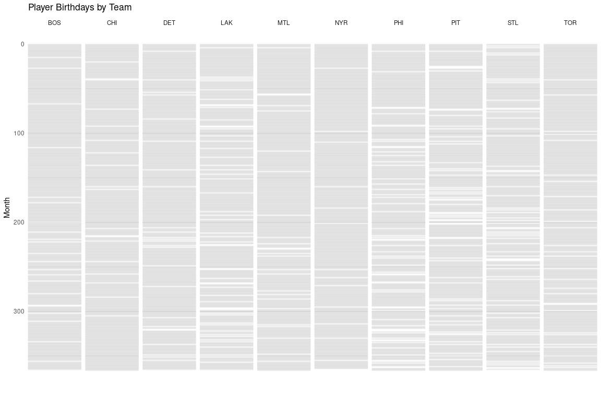

# Tidytuesday 2024-01

This is the notebook for analysis of the data of week 01 (2024) for the
[tidytuesday](https://tidytues.day) project. The game is on!

Okay let us see what we have.

``` r
# Load TidyTuesday Data
tuesdata <- tidytuesdayR::tt_load(2024, week = 2)
```

    ## 
    ##  Downloading file 1 of 4: `canada_births_1991_2022.csv`
    ##  Downloading file 2 of 4: `nhl_player_births.csv`
    ##  Downloading file 3 of 4: `nhl_rosters.csv`
    ##  Downloading file 4 of 4: `nhl_teams.csv`

``` r
births_aggregate <- tuesdata$canada_births_1991_2022
births_total <- tuesdata$nhl_player_births
rosters <- tuesdata$nhl_rosters
teams <- tuesdata$nhl_teams
player_stats <- read_csv(paste0(here(), "/data/player_stats.csv"))

# Might just join teams and players

data <- rosters %>% 
  left_join(teams, by = "team_code") %>% 
  rename("team_name" = full_name) %>% 
  mutate(player_name = paste(first_name, last_name)) %>% 
  select(player_name,
         season, 
         position_type, 
         birth_date, 
         birth_city,
         birth_country,
         birth_state_province,
         team_name,
         team_code)
```

## How many players in each team?

``` r
data %>% 
  group_by(team_code) %>% 
  distinct(player_name) %>% 
  count(sort = T) 
```

    ## # A tibble: 58 × 2
    ## # Groups:   team_code [58]
    ##    team_code     n
    ##    <chr>     <int>
    ##  1 NYR        1114
    ##  2 BOS        1059
    ##  3 CHI        1019
    ##  4 TOR        1010
    ##  5 DET         958
    ##  6 MTL         936
    ##  7 PIT         771
    ##  8 STL         710
    ##  9 LAK         704
    ## 10 VAN         683
    ## # ℹ 48 more rows

``` r
# Convert 'birth_date' to Date type and extract day of the year
data$birth_date <- as.Date(data$birth_date)
data$day_of_year <- yday(data$birth_date)

# Plotting
data %>%
  mutate(team_code = fct_lump(team_code, 10)) %>%
  filter(team_code != "Other") %>%
  mutate(month = as_factor(month(birth_date))) %>% 
  ggplot(aes(y = day_of_year, x = team_name)) +
  geom_hline(aes(yintercept = as.numeric(day_of_year)),
             color = "gray10",
             linewidth = 1,
             alpha = 0.08) +
  scale_y_reverse() +
  facet_wrap(~ team_code, ncol = 10, strip.position = 'top') +
  labs(x = "", y = "Month", title = "Player Birthdays by Team") +
  theme_minimal()
```



## Get additional data

I want to get some additional stats about players from the

``` r
library(furrr)
library(dplyr)
library(jsonlite)

plan(multisession)

getCareerTotals <- function(playerId) {
  api_url <- paste0("https://api-web.nhle.com/v1/player/", playerId, "/landing")
  tryCatch({
    player_info <- jsonlite::fromJSON(api_url)
    career_totals <- player_info$careerTotals$regularSeason
    return(career_totals)
  }, error = function(e) {
    cat("Error fetching data for player ID:", playerId, "\n")
    return(NULL)
  })
}


players <- rosters %>%
  distinct(player_id) %>% 
  mutate(careerTotals = future_map(player_id, getCareerTotals, .progress = T)) %>%
  unnest_wider(careerTotals)
```
